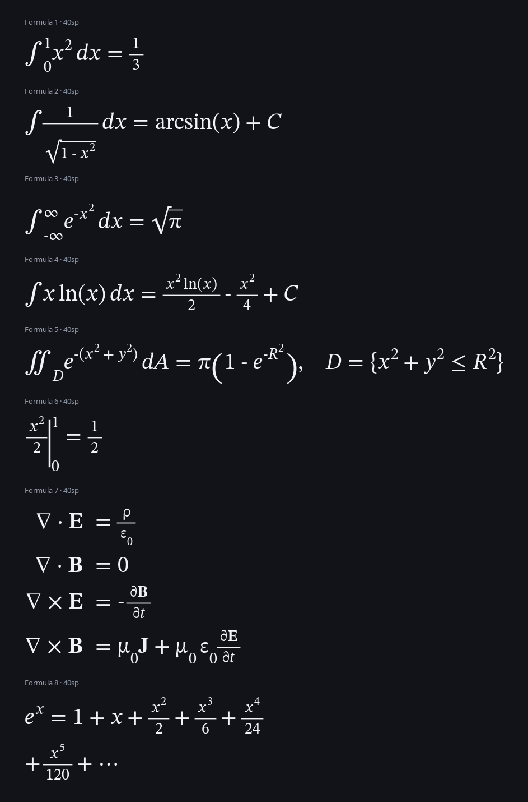

# Orcex

Ultra-lightweight native LaTeX math library for Kotlin Multiplatform under `ru.wertik.orcex`.

[](https://github.com/wertikolix/Orcex/actions/workflows/ci.yml)
[](https://central.sonatype.com/artifact/ru.wertik.orcex/orcex-core)

## Preview

Rendered natively with the bundled STIX Two Math font:



## Modules

| Module | Purpose | Runtime dependencies |
| --- | --- | --- |
| `orcex-core` | LaTeX lexer, syntax parser and AST | none |
| `orcex-layout` | Platform-neutral math layout and draw command plan | `orcex-core` |
| `orcex-render-android` | Native Android `Canvas`/`Paint` renderer | `orcex-core`, `orcex-layout` |
| `orcex-font-stix2-android` | Optional bundled STIX Two Math OpenType font | `orcex-render-android` |

The parser and layout do not require Android or a bundled font. Apps that already provide a math `Typeface` can omit `orcex-font-stix2-android`.

`orcex-core` and `orcex-layout` publish KMP variants for Android, JVM, Linux x64, Windows x64, macOS x64/Arm64 and iOS x64/Arm64/simulator Arm64.

## Dependency

```kotlin
repositories { mavenCentral() }

commonMain.dependencies {
    implementation("ru.wertik.orcex:orcex-core:0.3.1")
    implementation("ru.wertik.orcex:orcex-layout:0.3.1")
}

androidMain.dependencies {
    implementation("ru.wertik.orcex:orcex-render-android:0.3.1")
    implementation("ru.wertik.orcex:orcex-font-stix2-android:0.3.1")
}
```

The Maven group is `ru.wertik.orcex` under the verified `ru.wertik` Central namespace; source packages also remain `ru.wertik.orcex`.

## Supported syntax

- Symbols and operators such as `\alpha`, `\varepsilon`, `\nabla`, `\sum`, `\int`, `\iint`, `\leq`, `\sin`, `\arcsin`.
- Superscripts/subscripts, fractions, indexed radicals and scalable delimiters.
- Accents, text/style commands and `matrix`, `pmatrix`, `bmatrix`, `vmatrix`, `cases`, `aligned`/`align` environments.
- Optional constrained layout with automatic top-level line breaking at mathematical relations and operators.
- Individually disableable parser modules through `ParserConfig.enabledModules`.

## Android usage

```kotlin
val typeface = StixTwoMath.load(context)
val engine = AndroidLatexEngine(typeface)
val layout = engine.layout("\\frac{\\sum_{i=1}^{n} i^2}{\\sqrt{x+1}}", fontSize = 48f)
val renderer = CanvasMathRenderer(typeface, color = Color.BLACK)
renderer.draw(canvas, layout, x = 24f, y = 24f)
```

`CanvasMathRenderer` draws natively to Android `Canvas`; its `x`/`y` origin is the top-left of the generated layout. Use `layout.baseline` only when aligning the result with surrounding baseline-positioned text.

### Automatic line breaking

```kotlin
val expression = "e^x = 1 + x + \\frac{x^2}{2} + \\frac{x^3}{6} + \\frac{x^4}{24} + \\frac{x^5}{120} + \\cdots"
val layout = engine.layout(
    expression,
    fontSize = 40f,
    constraints = MathLayoutConstraints(maxWidth = availableWidth),
)
renderer.draw(canvas, layout, x = 24f, y = 24f)
```

Line breaking is opt-in, keeps fractions, radicals and aligned equations atomic, and prefers relation signs before additive or multiplicative operators.

### Maxwell example

```kotlin
val maxwell = """\begin{aligned}
    \nabla \cdot \mathbf{E} &= \frac{\rho}{\varepsilon_0} \\
    \nabla \cdot \mathbf{B} &= 0 \\
    \nabla \times \mathbf{E} &= -\frac{\partial \mathbf{B}}{\partial t} \\
    \nabla \times \mathbf{B} &= \mu_0 \mathbf{J} + \mu_0\,\varepsilon_0 \frac{\partial \mathbf{E}}{\partial t}
\end{aligned}""".trimIndent()

val layout = engine.layout(maxwell, fontSize = 40f)
renderer.draw(canvas, layout, x = 24f, y = 24f)
```

## Font

`orcex-font-stix2-android` bundles `STIXTwoMath-Regular.ttf` version `2.13 b171` from the STIX Fonts project. It is distributed under the SIL Open Font License 1.1; the license text is included in `orcex-font-stix2-android/OFL.txt`.

## Publishing

The repository is prepared for Maven Central Portal bundle publishing and GitHub Actions release automation. See `docs/PUBLISHING.md` for namespace choice, secrets, signing and release flow.

## Verification

```bash
./gradlew check :orcex-render-android:lintDebug :orcex-font-stix2-android:lintDebug
./gradlew koverVerify koverHtmlReport koverXmlReport
./gradlew centralBundleZip
```

Tests cover nested formulas, calculus operators, automatic line breaking, whitespace tolerance, module switches, malformed input, responsive geometry, matrix layout, rules, scripts and Unicode mathematical alphabet glyph output. CI enforces complete executable line coverage, writes reports to `build/reports/kover` and uploads a rendered STIX Two Math formula preview sheet.
