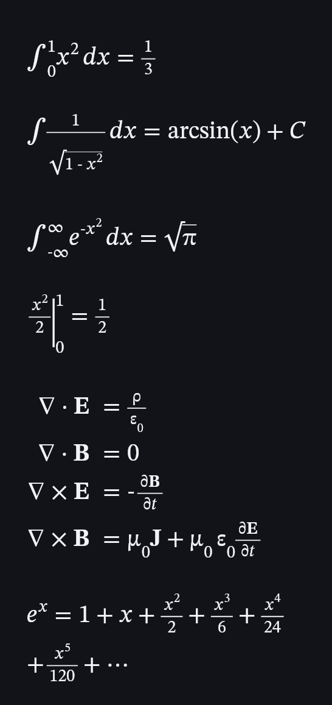

# Orcex

Ultra-lightweight native LaTeX math library for Kotlin Multiplatform under `ru.wertik.orcex`.

[](https://github.com/wertikolix/Orcex/actions/workflows/ci.yml)
[](https://central.sonatype.com/artifact/ru.wertik.orcex/orcex-core)

## Preview

Rendered natively with the bundled STIX Two Math font:



The preview above is generated and golden-tested through the public Skia renderer backend.

## Modules

| Module | Purpose | Runtime dependencies |
| --- | --- | --- |
| `orcex-core` | LaTeX lexer, syntax parser and AST | none |
| `orcex-layout` | Platform-neutral math layout and draw command plan | `orcex-core` |
| `orcex-render-android` | Native Android `Canvas`/`Paint` renderer | `orcex-core`, `orcex-layout` |
| `orcex-font-stix2-android` | Optional bundled STIX Two Math OpenType font | `orcex-render-android` |
| `orcex-render-skia` | Skia/Skiko renderer for desktop JVM and Apple targets | `orcex-core`, `orcex-layout`, Skiko |
| `orcex-render-compose` | Compose Multiplatform `Canvas` adapter for existing layouts | `orcex-layout`, Compose UI |

The parser and layout do not require Android or a bundled font. Apps that already provide a math `Typeface` can omit `orcex-font-stix2-android`.

`orcex-core` and `orcex-layout` publish KMP variants for Android, JVM, Linux x64, Windows x64, macOS x64/Arm64, iOS x64/Arm64/simulator Arm64 and wasmJs. `orcex-render-skia` publishes JVM desktop, Linux x64 Native, macOS Arm64 and iOS variants; Windows desktop renders through its JVM/Skiko variant. Android uses `orcex-render-android` directly or `orcex-render-compose` inside Compose UI. `orcex-render-compose` publishes Android, JVM desktop, modern iOS Arm64/simulator and wasmJs variants.

## Dependency

```kotlin
repositories { mavenCentral() }

commonMain.dependencies {
    implementation("ru.wertik.orcex:orcex-core:0.5.0")
    implementation("ru.wertik.orcex:orcex-layout:0.5.0")
    implementation("ru.wertik.orcex:orcex-render-compose:0.5.0")
}

androidMain.dependencies {
    implementation("ru.wertik.orcex:orcex-render-android:0.5.0")
    implementation("ru.wertik.orcex:orcex-font-stix2-android:0.5.0")
}

desktopMain.dependencies {
    implementation("ru.wertik.orcex:orcex-render-skia:0.5.0")
    runtimeOnly("org.jetbrains.skiko:skiko-awt-runtime-linux-x64:0.148.1") // choose the runtime for your desktop OS/architecture
}
```

The Maven group is `ru.wertik.orcex` under the verified `ru.wertik` Central namespace; source packages also remain `ru.wertik.orcex`.

## Supported syntax

- Symbols and operators such as `\alpha`, `\varepsilon`, `\nabla`, `\sum`, `\int`, `\iint`, `\leq`, `\sin`, `\arcsin`.
- Superscripts/subscripts, fractions, indexed radicals and scalable delimiters.
- Accents, text/style commands and `matrix`, `pmatrix`, `bmatrix`, `vmatrix`, `cases`, `aligned`/`align` environments.
- Colors via `\textcolor{red}{...}` / `\color{#FF8800}` (xcolor base names plus `#RGB`/`#RRGGBB`/`#AARRGGBB`), framed content via `\boxed{...}`.
- Stacked annotations via `\overset{!}{=}` and `\underset{n \to \infty}{\lim}`.
- Optional constrained layout with automatic top-level line breaking at mathematical relations and operators.
- Individually disableable parser modules through `ParserConfig.enabledModules`.

## Android usage

```kotlin
val typeface = StixTwoMath.load(context)
val engine = AndroidLatexEngine(typeface)
val layout = engine.layout("\\frac{\\sum_{i=1}^{n} i^2}{\\sqrt{x+1}}", fontSize = 48f)
val renderer = CanvasMathRenderer(typeface, color = Color.BLACK)
renderer.draw(canvas, layout, x = 24f, y = 24f)
```

`CanvasMathRenderer` draws natively to Android `Canvas`; its `x`/`y` origin is the top-left of the generated layout. Use `layout.baseline` only when aligning the result with surrounding baseline-positioned text.

### Automatic line breaking

```kotlin
val expression = "e^x = 1 + x + \\frac{x^2}{2} + \\frac{x^3}{6} + \\frac{x^4}{24} + \\frac{x^5}{120} + \\cdots"
val layout = engine.layout(
    expression,
    fontSize = 40f,
    constraints = MathLayoutConstraints(maxWidth = availableWidth),
)
renderer.draw(canvas, layout, x = 24f, y = 24f)
```

Line breaking is opt-in, keeps fractions, radicals and aligned equations atomic, and prefers relation signs before additive or multiplicative operators.

### Maxwell example

```kotlin
val maxwell = """\begin{aligned}
    \nabla \cdot \mathbf{E} &= \frac{\rho}{\varepsilon_0} \\
    \nabla \cdot \mathbf{B} &= 0 \\
    \nabla \times \mathbf{E} &= -\frac{\partial \mathbf{B}}{\partial t} \\
    \nabla \times \mathbf{B} &= \mu_0 \mathbf{J} + \mu_0\,\varepsilon_0 \frac{\partial \mathbf{E}}{\partial t}
\end{aligned}""".trimIndent()

val layout = engine.layout(maxwell, fontSize = 40f)
renderer.draw(canvas, layout, x = 24f, y = 24f)
```

## Skia usage

```kotlin
val typeface = requireNotNull(FontMgr.default.makeFromFile("STIXTwoMath-Regular.ttf"))
val engine = SkiaLatexEngine(typeface)
val layout = engine.layout("\\int_0^1 x^2 \\, dx = \\frac{1}{3}", fontSize = 48f)
val renderer = SkiaMathRenderer(typeface, color = 0xFF111318.toInt())
renderer.draw(canvas, layout, x = 24f, y = 24f)
```

`orcex-render-skia` accepts a consumer-provided Skia `Typeface` and `Canvas`; it does not bundle fonts or own a window/surface.

## Compose adapter

```kotlin
val renderer = rememberComposeMathRenderer(stixTwoMathFamily)
val engine = remember(renderer) { MathLayoutEngine(renderer) }
val layout = engine.layout(parser.parse(formula), MathStyle(fontSize = 48f))
OrcexMath(layout = layout, renderer = renderer, contentDescription = formula)
```

Use `drawMathLayout(...)` inside an existing Compose `Canvas` when the surrounding UI owns sizing or animation.

## Font

`orcex-font-stix2-android` bundles `STIXTwoMath-Regular.ttf` version `2.13 b171` from the STIX Fonts project. It is distributed under the SIL Open Font License 1.1; the license text is included in `orcex-font-stix2-android/OFL.txt`.

## Publishing

The repository is prepared for Maven Central Portal bundle publishing and GitHub Actions release automation. See `docs/PUBLISHING.md` for namespace choice, secrets, signing and release flow.

## Verification

```bash
./gradlew check :orcex-render-android:lintDebug :orcex-font-stix2-android:lintDebug
./gradlew koverVerify koverHtmlReport koverXmlReport
./gradlew centralBundleZip
```

Tests cover nested formulas, calculus operators, automatic line breaking, whitespace tolerance, module switches, malformed input, responsive geometry, matrix layout, rules, scripts, Unicode mathematical alphabet glyph output and Skia raster rendering. CI enforces complete executable line coverage for the covered core/layout/Skia backend, runs Compose adapter geometry tests and uploads golden-tested rendered STIX Two Math preview sheets.
